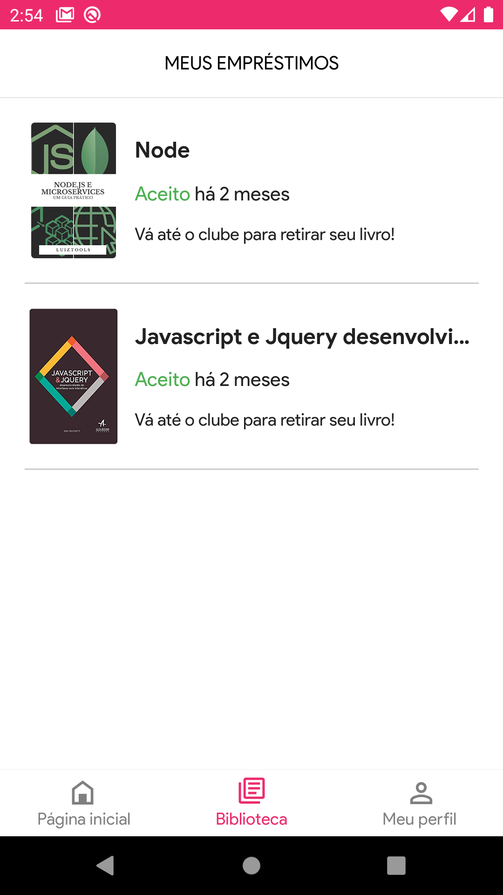
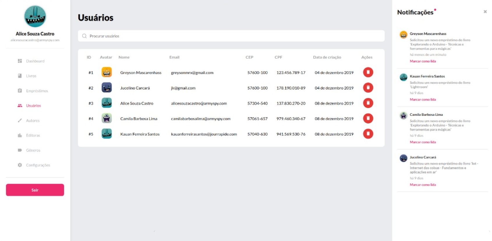

<h1 align="center">
 
</h1>

<h3 align="center">
 Online library system for the management of the passarinhar reading club
</h3>

  
  
  

  <a href="#features">Features</a>&nbsp;&nbsp;&nbsp;|&nbsp;&nbsp;&nbsp;
  <a href="#getting-started">Getting started</a>&nbsp;&nbsp;&nbsp;|&nbsp;&nbsp;&nbsp;
  <a href="#contributing">Contributing</a>&nbsp;&nbsp;&nbsp;|&nbsp;&nbsp;&nbsp;
  <a href="#license">License</a>

  
  
  
  

  

## Features

- **React Js** — A JavaScript library for building user interfaces
- **React Native** — A lib that provides a way to create native apps for Android and iOS
- **Node Js** — A web framework for Node Js
- **MongoDB** — A cross-platform and open-source document-oriented database
- **Express** — A web framework for Node
- **Sequelize** — SQL dialect ORM for Node.js
- **Yup** - Object schema validation
- **Lint** — ESlint/Prettier/Editor Config

## Getting started

1. Clone this repo using `git clone https://github.com/greysonmrx/Passarinhar.git`
2. Move to the appropriate directory: `cd Passarinhar`. 

### Getting started with the backend server

1. Move yourself to the backend folder: `cd Backend`
2. Run `yarn` to install dependencies 
3. Run `yarn dev` to start the server

### Getting started with the frontend app

1. Move yourself to the frontend folder: `cd Frontend`
2. Run `yarn` to install dependencies 
3. Run `yarn start` to start the web application

### Getting started with the mobile app

1. Move yourself to the mobile folder: `cd Mobile`
2. Run `yarn` to install dependencies 
3. Run `react-native run-ios` (or `run-android` if your prefer) to start the mobile app

Note: If you choose to start the mobile app in the android emulator, you will have to start the emulator before using
the `run-android` command.

## Contributing

Please read [CONTRIBUTING.md](CONTRIBUTING.md) for details on our code of conduct, and the process for submitting pull requests.

## License

This project is licensed under the MIT License - see the [LICENSE.md](LICENSE.md) file for details.

Made with :hearts: by Greyson Mascarenhas :wave:
